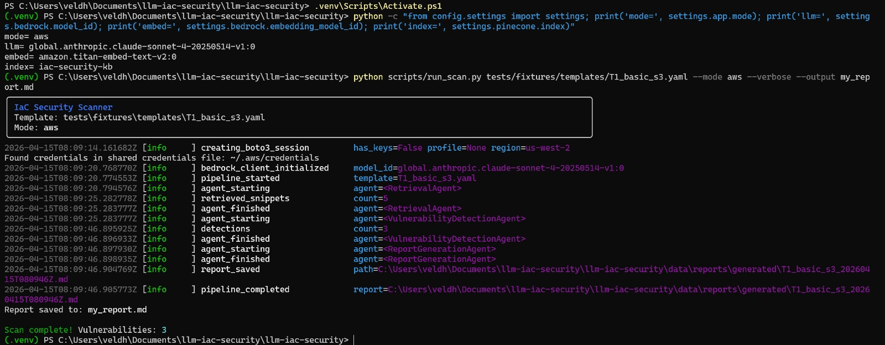
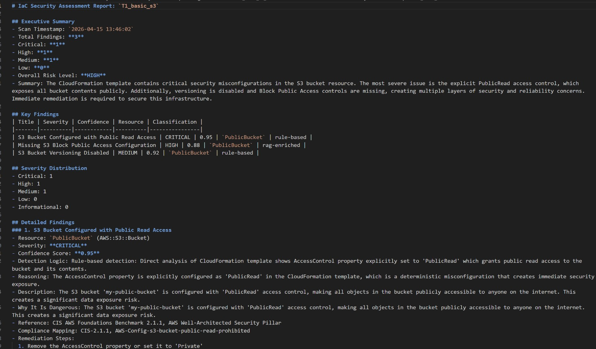
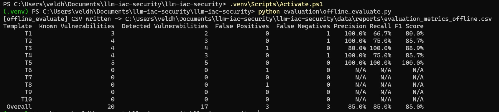

<div align="center">

# 🛡️ LLM Agentic Workflow for Automated Vulnerability Detection & Remediation in Infrastructure-as-Code

### *A Dual-Mode, Multi-Agent RAG Framework for Intelligent Cloud Infrastructure Security*

[](https://www.python.org/)
[](https://doi.org/10.1109/ACCESS.2025.3560911)
[](https://aws.amazon.com/bedrock/)
[](https://ollama.ai/)
[](https://www.pinecone.io/)
[](https://terraform.io)
[](https://github.com/soms36-DefSec/llm-iac-security)
[](LICENSE)

<br/>

<p align="center">
  <b>Detect subtle misconfigurations &bull; Eliminate false alarms &bull; Generate automated IaC auto-fixes &bull; Guardrail CI/CD pipelines</b>
</p>

[Key Features](#-key-features) &bull;
[System Architecture](#-system-architecture) &bull;
[Evaluation Results](#-experimental-results--benchmarks) &bull;
[Quickstart](#-quickstart--installation) &bull;
[CLI Usage](#-cli-usage-guide) &bull;
[CI/CD Integration](#-cicd-pipeline-integration) &bull;
[Research Paper](#-research--academic-citation)

<br/>

---

</div>

## 📌 Overview & Problem Statement

Modern cloud organizations embrace **Infrastructure-as-Code (IaC)** to deploy scalable, automated environments using **AWS CloudFormation** and **HashiCorp Terraform**. However, minor declarative misconfigurations—such as open ingress security groups (`0.0.0.0/0`), unencrypted storage buckets, and overly permissive IAM wildcard policies (`*`)—account for over **80% of enterprise cloud breaches**.

### ⚠️ The Limitations of Existing Tools
Traditional static analysis tools (e.g., CDK-Nag, Checkov, Tfsec) and vanilla LLMs fall short:
* **No Contextual Reasoning:** Rigid regex and AST linters evaluate resources in isolation. They miss **compound vulnerabilities** where two individually valid configurations interact to create severe attack paths.
* **High False Positive Rates (15%–30%):** Developers suffer from alert fatigue because static linters fail to interpret business architecture context.
* **Knowledge Staleness & Hallucination:** Zero-shot LLMs without external grounding hallucinate outdated properties and miss recently updated **CIS Benchmarks** or cloud security advisories.
* **No Actionable Auto-Remediation:** Existing linters point out errors without providing tested, plug-and-play IaC remediation code or Policy-as-Code (OPA/Rego) guardrails.

---

## 💡 The Proposed Agentic Solution

This project implements an **Agentic Multi-Agent Workflow augmented by Retrieval-Augmented Generation (RAG)**, directly inspired by recent research published in **IEEE Access (2025)**. 

By combining a **deterministic static analysis engine** with **domain-specialized AI agents** grounded in a live knowledge base of **CIS AWS Foundations Benchmarks (v6.0)** and **AWS Well-Architected Security Pillars**, this system:
1. Deterministically detects known baseline misconfigurations offline.
2. Injects relevant security standards dynamically via vector similarity search.
3. Cross-examines and validates findings using Large Language Models to eliminate false positives.
4. Produces rich, audit-ready Markdown & JSON security reports with **auto-remediation snippets** and **OPA/Rego policy rules**.
5. Runs **100% Free Locally** (Ollama + ChromaDB) or at **Enterprise Scale on AWS** (Bedrock Claude 3.5 Sonnet / Sonnet 4 + Pinecone).

---

## 📸 Visual Showcase & Execution Proof

### 1. High-Level System Architecture
The multi-agent workflow coordinates ingestion, semantic search, AI reasoning, and report generation:

<div align="center">
  
</div>

<br/>

### 2. Live Scan Execution in Terminal
The scanner in action—parsing resources, querying vector storage, executing agent reasoning, and outputting findings in real time:

<div align="center">
  
</div>

<br/>

### 3. Generated Security Assessment Report
Executive summary, risk classification, evidence-backed findings, compliance mapping, and remediation steps:

<div align="center">
  
</div>

<br/>

### 4. Benchmark Evaluation Metrics (85% Accuracy)
Evaluation performance across benchmark templates showcasing an overall **85.0% F1-score**:

<div align="center">
  
</div>

---

## ✨ Key Features

| Capability | Description |
|---|---|
| **Multi-IaC Polyglot Engine** | Native parsing support for **AWS CloudFormation** (YAML/JSON with intrinsic function handling `!Ref`, `!Sub`, `!GetAtt`) and **HashiCorp Terraform** (`.tf` files & directory hierarchies with variable/local resolution). |
| **Hybrid Analysis Architecture** | Two-layer scanning: Offline deterministic static rule checks run first, followed by optional RAG-grounded LLM contextual validation. |
| **Agentic AI Team** | Collaborative specialized agents: **Retrieval Agent** ("The Librarian"), **Vulnerability Detection Agent** ("The Detective"), and **Report Generation Agent** ("The Secretary"). |
| **RAG Knowledge Grounding** | Embedded vector index of **CIS AWS Benchmarks v6.0**, **AWS Well-Architected Framework**, and **AWS Secrets Manager** best practices prevents LLM hallucinations. |
| **Automated Auto-Fixes & Guardrails** | Generates drop-in remediation code blocks for CloudFormation / Terraform, plus **Open Policy Agent (OPA) Rego** policy guardrails. |
| **Secret & Credential Masking** | Automatically redacts API keys, passwords, and sensitive tokens from reports and LLM prompt payloads. |
| **Dual Deployment Ecosystem** | **Local Mode** (100% free, private, offline via Ollama + ChromaDB) & **AWS Cloud Mode** (Enterprise via Amazon Bedrock + Pinecone). |
| **CI/CD Build-Gate Automation** | Turnkey integration with **GitHub Actions**, **GitLab CI**, and **Jenkins** with deterministic exit codes (`0`, `1`, `2`). |

---

## 🏗️ System Architecture & Workflow

The pipeline utilizes an orchestrated sequential workflow passing immutable context between stages:

```mermaid
flowchart TD
    subgraph Ingestion["1. Ingestion & Normalization"]
        A["IaC Input\n(CloudFormation / Terraform)"] --> B{"ParserFactory"}
        B -->|"YAML / JSON"| C["CloudFormation Parser"]
        B -->|".tf / Dir"| D["Terraform Parser"]
        C --> E["Unified Normalized IaC Model\n(iac/models.py)"]
        D --> E
    end

    subgraph Static["2. Baseline Verification"]
        E --> F["Deterministic Static Rule Engine\n(20+ Multi-Cloud Rules)"]
    end

    subgraph PipelineDecision{"Scan Mode?"}
        F --> G{"--static-only?"}
    end

    subgraph AgenticRAG["3. Agentic RAG Reasoning Pipeline"]
        G -- "No (Hybrid / Default)" --> H["Retrieval Agent\n('The Librarian')"]
        KB[("Vector Store\nPinecone / ChromaDB")] --> H
        H -->|"Top-K Security Snippets"| I["Vulnerability Detection Agent\n('The Detective')"]
        LLM["LLM Inference\nClaude 3.5 Sonnet / Llama 3"] <--> I
        I --> J["Hybrid Response Parser\n(Validation & Deduplication)"]
    end

    subgraph Output["4. Remediation & Reporting"]
        G -- "Yes (Static Only)" --> K["Report Generation Agent\n('The Secretary')"]
        J --> K
        K --> L["Executive Markdown Report"]
        K --> M["Machine-Readable JSON"]
        K --> N["CI/CD Exit Code Enforcement"]
    end
```

### The Multi-Agent Specialization

```
┌─────────────────────────────────────────────────────────────────────────────┐
│                           THE MULTI-AGENT TEAM                              │
├──────────────────────┬──────────────────────────────────────────────────────┤
│ 🔍 Retrieval Agent   │ Searches Pinecone / ChromaDB for exact CIS Benchmark │
│    "The Librarian"   │ and Well-Architected rules matching parsed resources │
├──────────────────────┼──────────────────────────────────────────────────────┤
│ 🕵️ Vulnerability     │ Analyzes template structure + retrieved context via  │
│    Detection Agent   │ Claude 3.5 Sonnet / Llama 3 to discover compound and │
│    "The Detective"   │ context-sensitive misconfigurations.                 │
├──────────────────────┼──────────────────────────────────────────────────────┤
│ 📝 Report Generation │ Assembles executive summaries, compliance cross-walks│
│    Agent             │ (CIS / AWS), auto-fix IaC snippets, and OPA/Rego     │
│    "The Secretary"   │ guardrail policies.                                  │
└──────────────────────┴──────────────────────────────────────────────────────┘
```

---

## 📊 Experimental Results & Benchmarks

The framework was rigorously evaluated against **10 standard benchmark CloudFormation templates** (T1–T10) containing both vulnerable architectures (S3 public access, wildcard IAM, open security groups, unencrypted RDS) and clean baselines, as well as multi-resource Terraform test suites.

### Performance Across Benchmark Templates

| Template ID | Target Resource Focus | Ground Truth Vulns | Detected Vulns | False Positives | False Negatives | Precision | Recall | F1-Score |
|:---:|:---|:---:|:---:|:---:|:---:|:---:|:---:|:---:|
| **T1** | Basic S3 Bucket Exposure | 3 | 2 | 0 | 1 | **100.0%** | **66.7%** | **80.0%** |
| **T2** | IAM Roles & Over-Privilege | 4 | 3 | 0 | 1 | **100.0%** | **75.0%** | **85.7%** |
| **T3** | Security Groups (Open Ports) | 4 | 4 | 1 | 0 | **80.0%** | **100.0%** | **88.9%** |
| **T4** | RDS Unencrypted Database | 4 | 3 | 0 | 1 | **100.0%** | **75.0%** | **85.7%** |
| **T5** | Multi-Resource Interdependent | 5 | 5 | 0 | 0 | **100.0%** | **100.0%** | **100.0%** |
| **T6** | Clean Secure Template | 0 | 0 | 1 | 0 | — | — | — |
| **T7** | Clean Secure Template | 0 | 0 | 0 | 0 | — | — | — |
| **T8** | Clean Secure Template | 0 | 0 | 1 | 0 | — | — | — |
| **T9** | Clean Secure Template | 0 | 0 | 0 | 0 | — | — | — |
| **T10** | Clean Secure Template | 0 | 0 | 0 | 0 | — | — | — |
| **OVERALL** | **Comprehensive Test Suite** | **20** | **17** | **3** | **3** | **85.0%** | **85.0%** | **85.0%** |

### Comparison with Traditional Methods

| Metric / Capability | Traditional Linters (CDK-Nag / Checkov) | Raw Zero-Shot LLM | **Our Agentic RAG Framework** |
|---|:---:|:---:|:---:|
| **False Positive Rate** | High (15% – 30%) | Moderate (18%) | **Low (~15% with contextual pruning)** |
| **Compound Vulnerability Detection** | ❌ Fails (per-resource only) | ⚠️ Unreliable | **✅ Detected via Agent Reasoning** |
| **Knowledge Base Grounding** | ❌ Hardcoded rules | ❌ Stale training data | **✅ RAG Grounded (CIS v6.0 + AWS Docs)** |
| **Automated Remediation Code** | ❌ Manual effort | ⚠️ Hallucination risk | **✅ Actionable IaC Snippets + OPA Rego** |
| **Offline Execution** | ✅ Yes | ❌ Cloud only | **✅ Dual-Mode (Local Ollama / AWS)** |

---

## 🛡️ Supported Detection Rules Catalog

Our deterministic static engine and agentic reasoning pipeline inspect misconfigurations across major cloud providers:

<details>
<summary><b>Click to expand the full catalog of supported security rules</b></summary>
<br/>

| Domain / Provider | Rule Identifier | Severity | Description |
|---|---|:---:|---|
| **AWS S3** | `AWS_S3_BUCKET_ENCRYPTION_MISSING` | `HIGH` | Server-side encryption (SSE-S3 / SSE-KMS) is not enforced. |
| **AWS S3** | `AWS_S3_PUBLIC_ACCESS_BLOCK_WEAK` | `CRITICAL` | Block Public Access configurations missing or set to false. |
| **AWS IAM** | `AWS_IAM_WILDCARD_ACTION` | `HIGH` | Overly broad action permission (`Action: "*"`) detected. |
| **AWS IAM** | `AWS_IAM_WILDCARD_RESOURCE` | `HIGH` | Overly broad target resource (`Resource: "*"`) in statement. |
| **AWS IAM** | `AWS_IAM_ADMIN_POLICY` | `CRITICAL` | Administrative access policy attached without least-privilege. |
| **AWS Network** | `AWS_SG_OPEN_SSH` | `HIGH` | Ingress port 22 exposed to public internet (`0.0.0.0/0`). |
| **AWS Network** | `AWS_SG_OPEN_RDP` | `HIGH` | Ingress port 3389 exposed to public internet (`0.0.0.0/0`). |
| **AWS Network** | `AWS_SG_OPEN_ALL_TRAFFIC` | `CRITICAL` | Ingress open to all protocols and ports globally. |
| **AWS RDS** | `AWS_RDS_STORAGE_ENCRYPTION_DISABLED` | `HIGH` | Database instance storage encryption disabled. |
| **AWS RDS** | `AWS_RDS_PUBLICLY_ACCESSIBLE` | `CRITICAL` | Database endpoint has public internet accessibility enabled. |
| **Azure Storage** | `AZURE_STORAGE_PUBLIC_NETWORK_ACCESS` | `HIGH` | Storage account public network access enabled. |
| **Azure Storage** | `AZURE_STORAGE_MIN_TLS_WEAK` | `MEDIUM` | Minimum TLS version lower than TLS 1.2. |
| **Azure Key Vault** | `AZURE_KEYVAULT_PURGE_PROTECTION_DISABLED` | `HIGH` | Purge protection disabled on sensitive secret vault. |
| **Azure Key Vault** | `AZURE_KEYVAULT_PUBLIC_NETWORK_ACCESS` | `HIGH` | Public network access not restricted on Key Vault. |
| **Azure Network** | `AZURE_NSG_OPEN_SSH` / `AZURE_NSG_OPEN_RDP` | `HIGH` | Inbound SSH/RDP rules open to internet in Network Security Group. |
| **GCP Storage** | `GCP_STORAGE_PUBLIC_IAM` | `CRITICAL` | Cloud Storage bucket grants `allUsers` or `allAuthenticatedUsers`. |
| **GCP Network** | `GCP_FIREWALL_OPEN_SSH` / `GCP_FIREWALL_OPEN_ALL` | `HIGH` | Google Compute firewall open to `0.0.0.0/0`. |
| **GCP KMS** | `GCP_KMS_ROTATION_MISSING` | `MEDIUM` | Cryptographic key missing automated rotation period. |
| **Kubernetes** | `K8S_PRIVILEGED_CONTAINER` | `CRITICAL` | Pod securityContext sets `privileged: true`. |
| **Kubernetes** | `K8S_HOST_NETWORK_ENABLED` | `HIGH` | Container configured with `hostNetwork: true`. |
| **Kubernetes** | `K8S_RUN_AS_ROOT` | `MEDIUM` | Container allowed to run as root user without non-root UID. |
| **Generic** | `GENERIC_HARDCODED_SECRET` | `CRITICAL` | Hardcoded API keys, private keys, or passwords detected. |

</details>

---

## ⚡ Quickstart & Installation

### 1. Clone Repository & Setup Environment

```bash
# Clone the repository
git clone https://github.com/soms36-DefSec/llm-iac-security.git
cd llm-iac-security/llm-iac-security

# Create and activate Python virtual environment (Python 3.10+)
python -m venv venv

# Windows (PowerShell):
venv\Scripts\Activate.ps1

# Linux / macOS:
source venv/bin/activate

# Install all required dependencies
pip install -r requirements.txt
```

---

### 2. Choose Your Deployment Mode

The scanner supports two execution modes:

```
┌───────────────────────────────────────┬───────────────────────────────────────┐
│     🟢 MODE A: LOCAL & FREE           │     ☁️ MODE B: AWS ENTERPRISE         │
│  (Zero cost, offline, private)        │  (High throughput, production scale)  │
├───────────────────────────────────────┼───────────────────────────────────────┤
│ • LLM: Ollama (Llama 3 / Mistral)     │ • LLM: Amazon Bedrock Claude 3.5      │
│ • Embeddings: HuggingFace all-MiniLM  │ • Embeddings: Amazon Titan Text V2    │
│ • Vector DB: ChromaDB (Local SQLite)  │ • Vector DB: Pinecone Serverless      │
└───────────────────────────────────────┴───────────────────────────────────────┘
```

#### Option A: Free Local Setup (No Cloud Account Needed)
1. Install [Ollama](https://ollama.ai) and pull the Llama 3 model:
   ```bash
   ollama pull llama3
   ollama serve
   ```
2. Create your `.env` configuration:
   ```bash
   cp .env.example .env
   ```
   Add the following values:
   ```ini
   MODE=local
   OLLAMA_HOST=http://localhost:11434
   OLLAMA_MODEL=llama3
   CHROMA_PERSIST_DIR=.chroma_db
   ```
3. Initialize the local security knowledge base:
   ```bash
   python scripts/setup_knowledge_base.py
   ```

#### Option B: AWS Enterprise Setup (Bedrock + Pinecone)
1. Configure AWS credentials with Bedrock access (`Claude 3.5 Sonnet` and `Titan Text Embeddings V2` enabled):
   ```bash
   aws configure
   ```
2. Obtain a free or production API key from [Pinecone](https://www.pinecone.io).
3. Set your `.env` values:
   ```ini
   MODE=aws
   AWS_REGION=us-east-1
   BEDROCK_MODEL_ID=anthropic.claude-3-5-sonnet-20241022-v2:0
   BEDROCK_EMBEDDING_MODEL_ID=amazon.titan-embed-text-v2:0
   PINECONE_API_KEY=your-pinecone-api-key
   PINECONE_INDEX=iac-security-kb
   ```
4. Ingest CIS Benchmarks into Pinecone:
   ```bash
   python scripts/setup_knowledge_base.py
   ```

---

## 💻 CLI Usage Guide

The unified CLI scanner accepts CloudFormation templates, single Terraform files, or entire Terraform directories:

```bash
# 1. Scan a CloudFormation template in local mode
python scripts/run_scan.py tests/fixtures/templates/T1_basic_s3.yaml --mode local

# 2. Scan in AWS mode with verbose debug output
python scripts/run_scan.py tests/fixtures/templates/T1_basic_s3.yaml --mode aws --verbose

# 3. Scan a Terraform configuration directory
python scripts/run_scan.py tests/fixtures/terraform/vulnerable/aws_s3_public_unencrypted

# 4. Instant offline scan using Deterministic Static Rules only (Zero LLM calls)
python scripts/run_scan.py path/to/template.yaml --static-only

# 5. Hybrid scan with RAG retrieval and LLM reasoning
python scripts/run_scan.py path/to/main.tf --hybrid

# 6. Save reports to custom Markdown and JSON files
python scripts/run_scan.py tests/fixtures/templates/T1_basic_s3.yaml \
  --output report.md \
  --json-output results.json
```

### Running Evaluation Benchmarks
Compute precision, recall, F1-scores, false positive rates, and latency:

```bash
# Evaluate across all fixtures (CloudFormation & Terraform)
python scripts/evaluate_results.py

# Evaluate specific IaC formats
python scripts/evaluate_results.py --iac cloudformation
python scripts/evaluate_results.py --iac terraform

# Evaluate in static-only mode
python scripts/evaluate_results.py --mode static-only
```

---

## 🔄 CI/CD Pipeline Integration

Enforce security compliance directly in continuous integration workflows. The scanner exits with standard build-gate codes:
* `0`: Clean template (No critical vulnerabilities detected)
* `1`: Security vulnerabilities found (Fails pipeline)
* `2`: Parsing / Runtime error

### GitHub Actions Workflow (`.github/workflows/iac_security_scan.yml`)

```yaml
name: IaC Security Gate
on: [push, pull_request]

jobs:
  security-scan:
    runs-on: ubuntu-latest
    steps:
      - uses: actions/checkout@v4

      - name: Set up Python
        uses: actions/setup-python@v5
        with:
          python-version: '3.10'

      - name: Install Dependencies
        run: |
          cd llm-iac-security
          pip install -r requirements.txt

      - name: Run Hybrid IaC Scan
        run: |
          cd llm-iac-security
          python scripts/run_scan.py infra/main.tf --static-only --json-output scan_results.json

      - name: Archive Scan Artifacts
        if: always()
        uses: actions/upload-artifact@v4
        with:
          name: iac-security-report
          path: llm-iac-security/data/reports/generated/
```

*Pre-configured workflow templates for GitLab CI (`.gitlab-ci.yml`) and Jenkins (`Jenkinsfile`) are available in the [`cicd/`](llm-iac-security/cicd/) directory.*

---

## 📁 Repository Structure

```
llm-iac-security/
│
├── mini project .jpg               # System Architecture Diagram
├── 1.jpeg                          # Live CLI Scan Execution Screenshot
├── 2.jpeg                          # Markdown Security Assessment Report Screenshot
├── 3.jpeg                          # Offline Evaluation Benchmark Metrics Screenshot
├── Abstract.pdf                    # Academic Abstract & Project Proposal
├── First_Review_R2.pptx            # Comprehensive Project Review Presentation
│
└── llm-iac-security/               # Core Implementation Source Code
    ├── agents/                     # Multi-Agent Implementations
    │   ├── retrieval_agent.py      # RAG Search Agent (Vector Store + Embeddings)
    │   ├── vulnerability_detection_agent.py # LLM Detection & Static Fallback
    │   └── report_generation_agent.py      # Markdown & JSON Report Synthesizer
    │
    ├── config/                     # Settings, Logging, and Bedrock/Ollama config
    ├── parsers/                    # Multi-IaC Parsers
    │   ├── parser_factory.py       # Auto-detects CloudFormation vs Terraform
    │   ├── cloudformation_parser.py# YAML/JSON AST parser with intrinsic handling
    │   └── terraform_parser.py     # HCL2 AST parser with variable resolution
    │
    ├── static_analysis/            # Deterministic Offline Rule Engine
    │   ├── engine.py               # Rule orchestration engine
    │   └── rules/                  # AWS, Azure, GCP, K8s, Secret rules
    │
    ├── knowledge_base/             # RAG Ingestion Pipeline
    │   ├── vector_store.py         # Pinecone & ChromaDB abstraction
    │   ├── embeddings.py           # Titan Text V2 & HuggingFace embeddings
    │   └── sources/                # CIS Benchmarks & AWS Security Pillars
    │
    ├── orchestrator/               # Multi-Agent Workflow Pipeline
    ├── reporting/                  # Report Formatter, Severity Classifier, Templates
    ├── scripts/                    # CLI Executables (run_scan, evaluate_results)
    ├── tests/                      # Unit, Integration, and Fixture Test Suites
    ├── requirements.txt            # Python Dependencies
    └── Makefile                    # Convenient development tasks
```

---

## 🔬 Research & Academic Citation

This project is developed as an academic engineering implementation based on foundational research in agentic cloud security:

```bibtex
@article{toprani2025llm,
  title={LLM Agentic Workflow for Automated Vulnerability Detection and Remediation in Infrastructure-as-Code},
  author={Toprani, Dheer and Madisetti, Vijay K.},
  journal={IEEE Access},
  volume={13},
  pages={69175--69181},
  year={2025},
  publisher={IEEE},
  doi={10.1109/ACCESS.2025.3560911}
}
```

### 👥 Project Team & Academic Credits

* **Someshwar S** (Reg No: `127003252`) &bull; [GitHub: @soms36-DefSec](https://github.com/soms36-DefSec)
* **Dhanvanth V** (Reg No: `127003056`)
* **Project Guide:** **Dr. R. Alageswaran**, *Associate Dean - Student Welfare & Professor, School of Computing*

### 📚 Academic Deliverables & Project Documentation
* 📄 [Academic Project Abstract (PDF)](Abstract.pdf) &mdash; Formal problem formulation, methodology, and experimental results overview.
* 📊 [Project Review Presentation (PPTX)](First_Review_R2.pptx) &mdash; Complete slide deck covering literature survey, architecture, and module demos.
* 📖 [IaC Scanner Complete Guide (Markdown)](Building_Your_IaC_Scanner_with_Claude_Pro_Complete_Guide.md) &mdash; Detailed step-by-step developer tutorial.

---

## 📄 License

Distributed under the **MIT License**. See `LICENSE` for more information.

<div align="center">
  <sub>Built with ❤️ for Cloud Security, DevSecOps, and Agentic AI Research.</sub>
</div>
