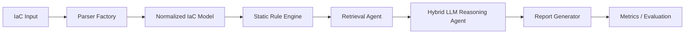

# LLM IaC Security Scanner

For the current implementation details, architecture, testing guide, and paper coverage, start here:

- [Implementation and Verification Guide](docs/IMPLEMENTATION_GUIDE.md)
- [Hybrid IaC Security Scanner Implementation Guide](docs/HYBRID_IAC_SECURITY_SCANNER_GUIDE.md)

Older sections in this README contain historical setup notes and may not reflect the current Sonnet 4 + Pinecone runtime exactly. Treat `config/settings.py`, `.env`, and the implementation guide as the source of truth.

---

All code changes are complete. Here's the **deployment procedure** for both environments:

---

## Deployment Procedure

### Prerequisites (both environments)
- **Python 3.10+** installed (verify: `python --version`)
- **Git** installed (verify: `git --version`)
- **pip** available (verify: `pip --version`)

### Step 1: Clone and Set Up Virtual Environment
```bash
git clone <your-repo-url>
cd llm-iac-security

# Create and activate virtual environment
python -m venv venv

# Windows:
venv\Scripts\activate
# macOS/Linux:
source venv/bin/activate
```

### Step 2: Install Dependencies
```bash
pip install -r requirements.txt
```

### Step 3: Configure Environment
```bash
cp .env.example .env
# Edit .env with your settings (see below for each mode)
```

---

### Environment A: Free/Local Mode (Ollama + ChromaDB + HuggingFace)

**Additional dependencies to install on your machine:**
1. **Ollama** — Download from [ollama.com](https://ollama.com) and install
2. Pull a model:
   ```bash
   ollama pull llama3
   ```
3. Start the Ollama server:
   ```bash
   ollama serve
   ```

**`.env` configuration for local mode:**
```
MODE=local
OLLAMA_HOST=http://localhost:11434
OLLAMA_MODEL=llama3
```
- ChromaDB and HuggingFace sentence-transformers are Python packages already in `requirements.txt` — no external services needed
- The HuggingFace embedding model (`all-MiniLM-L6-v2`) downloads automatically on first run (~80MB)
- ChromaDB stores data locally in `.chroma_db/` directory

**Initialize the knowledge base:**
```bash
python scripts/setup_knowledge_base.py
```

**Run a scan:**
```bash
python scripts/run_scan.py tests/fixtures/templates/T1_basic_s3.yaml --mode local
```

---

### Environment B: Paid/AWS Mode (Bedrock + Pinecone + Titan Embeddings)

**External services to set up:**
1. **AWS Account** with Bedrock access enabled
   - Enable model access for `Claude 3.5 Sonnet v2` and `Titan Text Embeddings V2` in the AWS Bedrock console
2. **AWS CLI** installed and configured:
   ```bash
   aws configure
   ```
3. **Pinecone account** — Sign up at [pinecone.io](https://pinecone.io) and get an API key

**`.env` configuration for AWS mode:**
```
MODE=aws
AWS_REGION=us-east-1
AWS_ACCESS_KEY_ID=AKIA...
AWS_SECRET_ACCESS_KEY=...
BEDROCK_MODEL_ID=anthropic.claude-3-5-sonnet-20241022-v2:0
BEDROCK_EMBEDDING_MODEL_ID=amazon.titan-embed-text-v2:0
PINECONE_API_KEY=your-pinecone-api-key
PINECONE_INDEX=iac-security-kb
```

**Initialize the knowledge base:**
```bash
python scripts/setup_knowledge_base.py
```

**Run a scan:**
```bash
python scripts/run_scan.py tests/fixtures/templates/T1_basic_s3.yaml --mode aws
```

---

### Step 4: Verify Installation (both modes)
```bash
# Run all unit tests (no external services needed)
python -m pytest tests/unit/ -v

# Run integration tests (mocked)
python -m pytest tests/integration/ -v

# Run evaluation metrics
python scripts/evaluate_results.py
```

### Step 5: CI/CD Setup (optional)

**GitHub Actions:**
- Copy `cicd/github_actions/iac_security_scan.yml` to `.github/workflows/iac_security_scan.yml`
- Add secrets in GitHub repo settings: `AWS_ROLE_ARN`, `AWS_REGION`, `PINECONE_API_KEY`

**GitLab CI:**
- Copy `cicd/gitlab_ci/.gitlab-ci.yml` to project root as `.gitlab-ci.yml`
- Add CI/CD variables in GitLab settings

**Jenkins:**
- Use `cicd/jenkins/Jenkinsfile` — configure credentials for `aws-credentials` and `pinecone-api-key`

### CLI Usage Summary
```bash
# Basic scan (uses MODE from .env)
python scripts/run_scan.py <template.yaml>
python scripts/run_scan.py <main.tf>
python scripts/run_scan.py <terraform-directory>

# Override mode via CLI
python scripts/run_scan.py <template.yaml> --mode local
python scripts/run_scan.py <template.yaml> --mode aws

# Custom output path
python scripts/run_scan.py <template.yaml> --output report.md
python scripts/run_scan.py <terraform-directory> --json-output results.json

# Static and hybrid modes
python scripts/run_scan.py tests/fixtures/terraform/vulnerable/aws_s3_public_unencrypted --static-only
python scripts/run_scan.py tests/fixtures/templates/T1_basic_s3.yaml --hybrid

# Verbose/debug logging
python scripts/run_scan.py <template.yaml> --verbose

# Using Makefile
make scan TEMPLATE=tests/fixtures/templates/T1_basic_s3.yaml MODE=local
make test
make setup-kb
```

---

## Current Hybrid IaC Scanner

The scanner now supports both AWS CloudFormation and Terraform. CloudFormation support is preserved, and Terraform `.tf` files or directories containing `.tf` files are selected automatically by the parser factory.



### Static Rules

The deterministic rule engine runs before any LLM call and works offline. Implemented rules include:

| Area | Rule IDs |
|------|----------|
| AWS S3 | `AWS_S3_BUCKET_ENCRYPTION_MISSING`, `AWS_S3_PUBLIC_ACCESS_BLOCK_WEAK` |
| AWS IAM | `AWS_IAM_WILDCARD_ACTION`, `AWS_IAM_WILDCARD_RESOURCE`, `AWS_IAM_ADMIN_POLICY` |
| AWS Network | `AWS_SG_OPEN_SSH`, `AWS_SG_OPEN_RDP`, `AWS_SG_OPEN_ALL_TRAFFIC` |
| AWS RDS | `AWS_RDS_STORAGE_ENCRYPTION_DISABLED`, `AWS_RDS_PUBLICLY_ACCESSIBLE` |
| Azure Storage | `AZURE_STORAGE_PUBLIC_NETWORK_ACCESS`, `AZURE_STORAGE_MIN_TLS_WEAK` |
| Azure Key Vault | `AZURE_KEYVAULT_PURGE_PROTECTION_DISABLED`, `AZURE_KEYVAULT_PUBLIC_NETWORK_ACCESS` |
| Azure Network | `AZURE_NSG_OPEN_SSH`, `AZURE_NSG_OPEN_RDP`, `AZURE_NSG_OPEN_ALL_TRAFFIC` |
| GCP Storage/KMS | `GCP_STORAGE_PUBLIC_IAM`, `GCP_KMS_ROTATION_MISSING` |
| GCP Network | `GCP_FIREWALL_OPEN_SSH`, `GCP_FIREWALL_OPEN_RDP`, `GCP_FIREWALL_OPEN_ALL_TRAFFIC` |
| Kubernetes | `K8S_PRIVILEGED_CONTAINER`, `K8S_HOST_NETWORK_ENABLED`, `K8S_ALLOW_PRIVILEGE_ESCALATION`, `K8S_RUN_AS_ROOT`, `K8S_DANGEROUS_CAPABILITIES` |
| Generic secrets | `GENERIC_HARDCODED_SECRET` |

Static-only mode never calls the LLM:

```bash
python scripts/run_scan.py path/to/iac --static-only
```

Hybrid mode runs static rules first, retrieves relevant guidance, then asks the LLM to validate, deduplicate, explain, and enrich findings:

```bash
python scripts/run_scan.py path/to/iac --hybrid
```

If retrieval or LLM enrichment is unavailable, the scanner returns static findings and clearly marks enrichment as skipped.

### IaC Risk Explainer + Auto-Fix Assistant

Every finding is enriched with cloud-engineer focused context:

- Plain-language risk explanation
- Likely attack path
- Business impact
- Compliance mapping hints
- Safe auto-fix guidance with an IaC snippet
- OPA/Rego policy-as-code guardrail starter

This enrichment runs in both static-only and hybrid modes, so it works even when the LLM is unavailable.

### Evaluation

Run evaluation against CloudFormation and Terraform fixtures:

```bash
python scripts/evaluate_results.py
python scripts/evaluate_results.py --iac terraform
python scripts/evaluate_results.py --iac cloudformation
python scripts/evaluate_results.py --mode static-only
python scripts/evaluate_results.py --mode hybrid-mocked
```

Evaluation writes JSON results to:

```text
data/reports/generated/evaluation_results.json
```

Metrics include true positives, false positives, false negatives, precision, recall, F1, per-rule metrics, per-template metrics, average latency, and total scan time.

### Adding Static Rules

1. Add a new rule class under `static_analysis/rules/`.
2. Inherit from `StaticRule`.
3. Accept the normalized `IaCTemplate`.
4. Return `StaticFinding` objects using `self.finding(...)`.
5. Register the rule in `static_analysis/engine.py`.
6. Add focused unit tests and fixture coverage.

### Adding Terraform Fixtures

Add vulnerable or clean fixtures under:

```text
tests/fixtures/terraform/vulnerable/<case>/main.tf
tests/fixtures/terraform/clean/<case>/main.tf
```

Then add expected findings to:

```text
tests/fixtures/ground_truth/terraform_annotations.json
```

Expected finding matches use `rule_id` and `resource_id`, for example:

```json
{"rule_id": "AWS_S3_BUCKET_ENCRYPTION_MISSING", "resource_id": "aws_s3_bucket.logs", "severity": "HIGH"}
```

### Current Scope Boundaries

- Terraform parsing depends on `python-hcl2`; the scanner now resolves common variables, locals, interpolation, conditionals, indexing, `jsonencode(...)`, and common functions such as `format`, `join`, `merge`, `lookup`, `coalesce`, and casing/conversion helpers.
- Terraform resource/data block lines and nested property line numbers are captured in normalized resource metadata.
- Static rules cover AWS plus Azure Storage, Azure Key Vault, Azure NSG, GCP Storage IAM, GCP Firewall, GCP KMS, and Kubernetes workload security checks.
- The static scanner remains offline and deterministic. It does not download remote modules, contact providers, or replace `terraform plan` for computed runtime values.
- Hybrid LLM reasoning validates and enriches findings but static findings remain the baseline.
- Secret-looking values are masked in findings and prompt summaries, but raw IaC files should still be handled as sensitive input.

---

### Summary of Files Modified/Created

| File | Change |
|------|--------|
| `config/settings.py` | Added `OllamaSettings`, `ChromaSettings`, `LocalEmbeddingSettings`, `is_local` property |
| `config/bedrock_config.py` | Made mode-aware (skips Bedrock init in local mode) |
| `knowledge_base/embeddings.py` | Added `HuggingFaceEmbeddings` class + `get_embeddings()` factory |
| `knowledge_base/vector_store.py` | Added `ChromaVectorStore` class + `get_vector_store()` factory |
| `knowledge_base/kb_manager.py` | Updated to use factory functions |
| `llm/bedrock_client.py` | Added `OllamaClient` class + `get_llm_client()` factory |
| `agents/vulnerability_detection_agent.py` | Uses `get_llm_client()` factory |
| `agents/report_generation_agent.py` | Uses `get_llm_client()` factory |
| `utils/aws_utils.py` | Guards against AWS calls in local mode |
| `scripts/run_scan.py` | Added `--mode`, `--output` flags + error handling |
| `cicd/pipeline_integration.py` | Added mode support |
| `.env.example` | Complete dual-mode configuration template |
| `requirements.txt` | Added `chromadb` dependency |
| `setup.py` | Added `extras_require` for local/aws/dev |
| `Makefile` | Added MODE support and clean target |
| `reporting/report_builder.py` | Fixed deprecation warning |
| CI/CD files | Updated for dual-mode (GitHub Actions, GitLab CI, Jenkinsfile) |
| `tests/` | Updated mock paths for factory functions |
| `tests/fixtures/ground_truth/annotations.json` | Added T7-T10 entries |
| `.gitignore` | Added `.chroma_db/`, `.cache/` |
