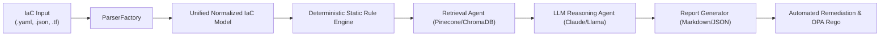

<div align="center">

# 🛡️ LLM IaC Security Scanner &mdash; Core Engine

[](https://www.python.org/)
[](https://doi.org/10.1109/ACCESS.2025.3560911)
[](https://aws.amazon.com/bedrock/)
[](https://ollama.ai/)
[](../README.md)

<p align="center">
  <b>Multi-Agent Hybrid Vulnerability Detection & Auto-Remediation for CloudFormation and Terraform</b>
</p>

</div>

---

> [!NOTE]
> For the comprehensive visual documentation, project screenshots, and research background, see the [Root Repository README](../README.md).
> Detailed implementation guides:
> - [Hybrid IaC Security Scanner Guide](docs/HYBRID_IAC_SECURITY_SCANNER_GUIDE.md)
> - [Implementation & Verification Guide](docs/IMPLEMENTATION_GUIDE.md)
> - [System Architecture Specification](docs/architecture.md)

---

## 🚀 Quick Setup & Execution

### 1. Prerequisites
* **Python 3.10+** (`python --version`)
* **pip** & **virtualenv**

```bash
# Activate virtual environment
python -m venv venv

# Windows
venv\Scripts\Activate.ps1

# Linux / macOS
source venv/bin/activate

# Install dependencies
pip install -r requirements.txt
```

### 2. Configure Environment (`.env`)

```bash
cp .env.example .env
```

#### Mode A: Free Local Offline (Ollama + ChromaDB)
```ini
MODE=local
OLLAMA_HOST=http://localhost:11434
OLLAMA_MODEL=llama3
CHROMA_PERSIST_DIR=.chroma_db
```
*Run Ollama in background:* `ollama serve` and `ollama pull llama3`.

#### Mode B: AWS Production Cloud (Bedrock + Pinecone)
```ini
MODE=aws
AWS_REGION=us-east-1
BEDROCK_MODEL_ID=anthropic.claude-3-5-sonnet-20241022-v2:0
BEDROCK_EMBEDDING_MODEL_ID=amazon.titan-embed-text-v2:0
PINECONE_API_KEY=your-pinecone-api-key
PINECONE_INDEX=iac-security-kb
```

### 3. Initialize Knowledge Base
Ingest CIS Benchmarks and AWS Security Frameworks:
```bash
python scripts/setup_knowledge_base.py
```

### 4. Run Security Scans

```bash
# CloudFormation template scan (Local mode)
python scripts/run_scan.py tests/fixtures/templates/T1_basic_s3.yaml --mode local

# CloudFormation template scan (AWS Bedrock mode)
python scripts/run_scan.py tests/fixtures/templates/T1_basic_s3.yaml --mode aws

# Terraform directory scan
python scripts/run_scan.py tests/fixtures/terraform/vulnerable/aws_s3_public_unencrypted

# Offline deterministic static analysis (Fast, 0 LLM cost)
python scripts/run_scan.py tests/fixtures/templates/T1_basic_s3.yaml --static-only

# Hybrid mode (Static rules + RAG + LLM Reasoning)
python scripts/run_scan.py tests/fixtures/templates/T1_basic_s3.yaml --hybrid

# Output to custom Markdown and JSON files
python scripts/run_scan.py tests/fixtures/templates/T1_basic_s3.yaml --output my_report.md --json-output results.json
```

---

## 🧪 Testing & Evaluation

```bash
# Run unit tests
python -m pytest tests/unit/ -v

# Run integration tests
python -m pytest tests/integration/ -v

# Run evaluation against ground-truth benchmarks
python scripts/evaluate_results.py
python scripts/evaluate_results.py --iac cloudformation
python scripts/evaluate_results.py --iac terraform
python scripts/evaluate_results.py --mode static-only
```

---

## ⚙️ Architecture & Modules


```mermaid
flowchart LR
    A["IaC Input\n(.yaml, .json, .tf)"] --> B["ParserFactory"]
    B --> C["Unified Normalized IaC Model"]
    C --> D["Deterministic Static Rule Engine"]
    D --> E["Retrieval Agent (Pinecone/ChromaDB)"]
    E --> F["LLM Reasoning Agent (Claude/Llama)"]
    F --> G["Report Generator (Markdown/JSON)"]
    G --> H["Automated Remediation & OPA Rego"]
```

* **`agents/`**: Multi-agent implementation (`RetrievalAgent`, `VulnerabilityDetectionAgent`, `ReportGenerationAgent`).
* **`parsers/`**: Polyglot parsers for CloudFormation (YAML/JSON) and Terraform (HCL2).
* **`static_analysis/`**: 20+ deterministic offline rules across AWS, Azure, GCP, and Kubernetes.
* **`knowledge_base/`**: Vector store and embedding managers (Titan V2, HuggingFace MiniLM, Pinecone, ChromaDB).
* **`reporting/`**: Markdown and JSON report synthesizer with risk explainer and auto-fix generation.
* **`scripts/`**: CLI entry points for scanning and evaluation.
