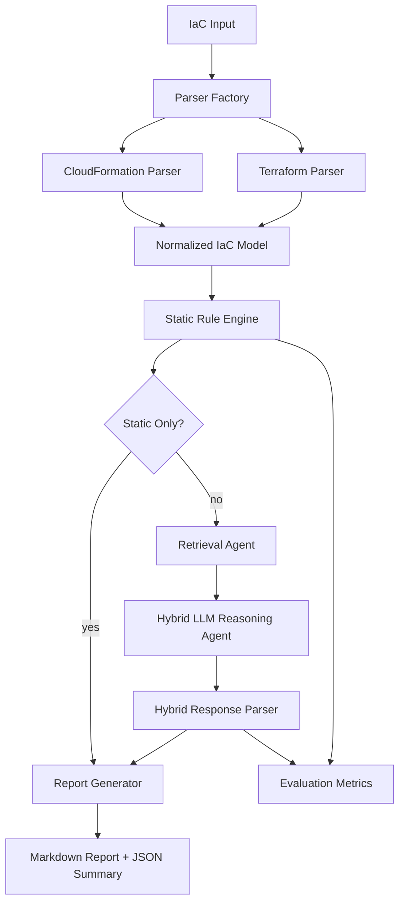

# Hybrid IaC Security Scanner Implementation Guide

This document explains the Terraform, static analysis, hybrid LLM, reporting, and evaluation work added to this project. It is written for learning: it describes what changed, why it changed, how the pieces connect, and how to build a similar project yourself.

## 1. What This Project Does Now

The project is now a hybrid Infrastructure-as-Code security scanner.

It accepts:

- AWS CloudFormation YAML, YML, and JSON templates.
- Terraform `.tf` files.
- Terraform directories containing one or more `.tf` files.

It scans IaC in two layers:

1. Static deterministic rules find known misconfigurations quickly and offline.
2. Optional hybrid LLM reasoning reviews the static findings, uses retrieved guidance, validates or deduplicates findings, and improves explanations.

The important design decision is that the LLM is no longer the only detector. Static rules are the baseline. If the LLM is unavailable or returns malformed JSON, the scanner still returns static findings.

## 2. Before And After

### Before

- Scanner mainly supported AWS CloudFormation.
- Detection depended heavily on LLM output.
- There was no normalized IaC schema shared by CloudFormation and Terraform.
- There was no Terraform parser.
- There was no deterministic static rule engine.
- Evaluation was limited and did not measure precision, recall, F1, false positives, false negatives, or latency across fixture sets.
- Reports did not clearly distinguish static findings from hybrid/LLM validated findings.
- Tests did not cover Terraform parsing, static-only mode, hybrid mocked mode, or Terraform fixture evaluation.

### After

- Scanner supports CloudFormation and Terraform.
- Parser selection is automatic through `ParserFactory`.
- CloudFormation and Terraform are converted into a shared normalized model.
- Static rules run first for deterministic detection.
- Hybrid LLM reasoning enriches findings, but never replaces static scanning.
- Static-only mode never calls the LLM.
- Hybrid mode uses static findings, retrieval snippets, and LLM reasoning.
- Malformed LLM JSON falls back to static findings.
- Reports include scan metadata, IaC type, severity counts, review status, detailed findings, source locations, and remediation.
- Evaluation computes TP, FP, FN, precision, recall, F1, per-rule metrics, per-template metrics, latency, and scan summary.
- Terraform fixtures and ground truth annotations were added.
- Tests cover parser selection, Terraform parser behavior, static rules, secret masking, hybrid parsing, pipeline flows, CLI JSON output, evaluation metrics, and CloudFormation backward compatibility.

## 3. Architecture

The scanner now follows this flow:



Core modules:

- `iac/models.py`: shared normalized IaC schema.
- `parsers/parser_factory.py`: chooses CloudFormation or Terraform parser.
- `parsers/cloudformation_parser.py`: preserves existing CloudFormation support and emits normalized resources.
- `parsers/terraform_parser.py`: parses Terraform files/directories and emits normalized resources.
- `static_analysis/`: deterministic static rule engine and rules.
- `agents/retrieval_agent.py`: retrieves guidance snippets for hybrid reasoning.
- `agents/vulnerability_detection_agent.py`: runs hybrid LLM reasoning and fallback behavior.
- `llm/prompt_templates.py`: strict hybrid JSON prompts.
- `llm/response_parser.py`: robust JSON parsing and static fallback.
- `reporting/markdown_formatter.py`: developer-friendly Markdown reports.
- `scripts/run_scan.py`: CLI scanner entry point.
- `scripts/evaluate_results.py`: evaluation metrics CLI.

## 4. Normalized IaC Model

The normalized model is the foundation of the upgrade. It lets downstream code scan CloudFormation and Terraform through the same interface.

File:

- `iac/models.py`

Main dataclasses:

```python
@dataclass(slots=True)
class IaCResource:
    logical_id: str
    resource_type: str
    provider: Provider = "unknown"
    name: str = ""
    properties: dict[str, Any] = field(default_factory=dict)
    source_file: str = ""
    line_number: int | None = None
    depends_on: list[str] = field(default_factory=list)
    metadata: dict[str, Any] = field(default_factory=dict)
```

```python
@dataclass(slots=True)
class IaCTemplate:
    iac_type: IaCType
    source_path: str
    raw_content: str | None = None
    resources: list[IaCResource] = field(default_factory=list)
    variables: dict[str, Any] = field(default_factory=dict)
    parameters: dict[str, Any] = field(default_factory=dict)
    outputs: dict[str, Any] = field(default_factory=dict)
    metadata: dict[str, Any] = field(default_factory=dict)
```

Why this matters:

- CloudFormation resources and Terraform resources have different shapes.
- Static rules should not need to know which parser produced the input unless provider-specific behavior requires it.
- Agents can summarize normalized resources for retrieval and LLM prompts.
- Evaluation can compare findings using consistent `rule_id`, `resource_id`, and `resource_type`.

Example normalized Terraform resource:

```python
IaCResource(
    logical_id="aws_s3_bucket.logs",
    resource_type="aws_s3_bucket",
    provider="aws",
    name="logs",
    properties={"bucket": "example-logs"},
    source_file="tests/fixtures/terraform/vulnerable/aws_s3_public_unencrypted/main.tf",
    line_number=1,
)
```

Example normalized CloudFormation resource:

```python
IaCResource(
    logical_id="LogsBucket",
    resource_type="AWS::S3::Bucket",
    provider="aws",
    name="LogsBucket",
    properties={"BucketName": "example-logs"},
    source_file="tests/fixtures/templates/T1_basic_s3.yaml",
)
```

## 5. Parser Factory

File:

- `parsers/parser_factory.py`

The parser factory centralizes parser selection.

Rules:

- `.yaml`, `.yml`, `.json` use `CloudFormationParser`.
- `.tf` uses `TerraformParser`.
- A directory containing `.tf` files uses `TerraformParser`.
- Unsupported paths raise `UnsupportedTemplateFormatError`.

This prevents CLI, pipeline, and tests from duplicating file detection logic.

## 6. Terraform Parser

File:

- `parsers/terraform_parser.py`

The Terraform parser uses `python-hcl2` to parse HCL2.

It supports:

- Single `.tf` files.
- Directories with multiple `.tf` files.
- `resource` blocks.
- `data` blocks.
- `variable` blocks.
- `output` blocks.
- `provider` blocks.
- `locals`.
- Common Terraform expressions.
- Source line metadata for resource/data blocks.
- Nested property line metadata.

### Resource Address Format

Terraform resources are normalized using this format:

```text
resource_type.resource_name
```

Example:

```text
aws_s3_bucket.logs
```

### Provider Detection

The parser detects provider from resource type prefixes:

- `aws_*` -> `aws`
- `azurerm_*` -> `azure`
- `google_*` -> `gcp`
- `kubernetes_*` -> `kubernetes`
- anything else -> `unknown`

### Expression Handling

Terraform is a language, not just a static config format. Full Terraform semantics require `terraform plan`, providers, modules, state, and variable resolution. This scanner intentionally stays offline, but the parser now handles many common static cases:

- Variable defaults: `var.env`
- Locals: `local.bucket_name`
- Interpolation: `"logs-${var.env}"`
- Conditionals: `var.env == "prod" ? "prod" : "dev"`
- Comparisons and boolean logic.
- Indexing into lists/maps.
- Dotted references like `var.tags.owner`.
- `jsonencode(...)` and `jsondecode(...)`
- Common functions:
  - `lower`
  - `upper`
  - `trimspace`
  - `format`
  - `join`
  - `split`
  - `concat`
  - `merge`
  - `lookup`
  - `coalesce`
  - `length`
  - `contains`
  - `element`
  - `startswith`
  - `endswith`
  - `replace`
  - `tolist`
  - `toset`
  - `tomap`
  - `tostring`
  - `tonumber`
  - `tobool`

The parser uses a fixed-point locals evaluation loop. This allows one local value to depend on another local value:

```hcl
locals {
  env         = lower(var.environment)
  bucket     = format("logs-%s", local.env)
  merged_tag = merge(var.tags, { Env = local.env })
}
```

### Line Numbers

The parser records:

- Resource/data block starting line.
- Nested property line numbers in `resource.metadata["property_line_numbers"]`.

Static findings now carry `line_number`, and reports show locations such as:

```text
tests/fixtures/terraform/vulnerable/aws_s3_public_unencrypted/main.tf:1
```

### Error Handling

Invalid HCL raises the project parsing exception instead of crashing unpredictably. Empty Terraform directories are handled gracefully.

## 7. Static Rule Engine

Files:

- `static_analysis/models.py`
- `static_analysis/base_rule.py`
- `static_analysis/engine.py`
- `static_analysis/rules/`

The static rule engine is deterministic. It never calls the LLM.

It accepts an `IaCTemplate` and returns `StaticFinding` objects.

`StaticFinding` includes:

- `finding_id`
- `rule_id`
- `title`
- `severity`
- `confidence`
- `iac_type`
- `provider`
- `resource_id`
- `resource_type`
- `source_file`
- `line_number`
- `description`
- `evidence`
- `remediation`
- `references`
- `tags`
- `detected_by`

### Rule Base Class

Every rule inherits from `StaticRule`.

The base class provides:

- `scan(template)`: implemented by each rule.
- `finding(...)`: helper that builds a stable `StaticFinding`.
- Common helper functions:
  - `truthy`
  - `falsey`
  - `as_list`
  - `get_any`
  - `safe_json`
  - `iter_policy_statements`
  - `mask_secret`
  - `is_reference_like`
  - `walk_properties`

### Built-In Rules

AWS S3:

- `AWS_S3_BUCKET_ENCRYPTION_MISSING`
- `AWS_S3_PUBLIC_ACCESS_BLOCK_WEAK`

AWS IAM:

- `AWS_IAM_WILDCARD_ACTION`
- `AWS_IAM_WILDCARD_RESOURCE`
- `AWS_IAM_ADMIN_POLICY`

AWS Network:

- `AWS_SG_OPEN_SSH`
- `AWS_SG_OPEN_RDP`
- `AWS_SG_OPEN_ALL_TRAFFIC`

AWS RDS:

- `AWS_RDS_STORAGE_ENCRYPTION_DISABLED`
- `AWS_RDS_PUBLICLY_ACCESSIBLE`

Azure:

- `AZURE_STORAGE_PUBLIC_NETWORK_ACCESS`
- `AZURE_STORAGE_MIN_TLS_WEAK`
- `AZURE_KEYVAULT_PURGE_PROTECTION_DISABLED`
- `AZURE_KEYVAULT_PUBLIC_NETWORK_ACCESS`
- `AZURE_NSG_OPEN_SSH`
- `AZURE_NSG_OPEN_RDP`
- `AZURE_NSG_OPEN_ALL_TRAFFIC`

GCP:

- `GCP_STORAGE_PUBLIC_IAM`
- `GCP_FIREWALL_OPEN_SSH`
- `GCP_FIREWALL_OPEN_RDP`
- `GCP_FIREWALL_OPEN_ALL_TRAFFIC`
- `GCP_KMS_ROTATION_MISSING`

Kubernetes:

- `K8S_PRIVILEGED_CONTAINER`
- `K8S_HOST_NETWORK_ENABLED`
- `K8S_ALLOW_PRIVILEGE_ESCALATION`
- `K8S_RUN_AS_ROOT`
- `K8S_DANGEROUS_CAPABILITIES`

Generic:

- `GENERIC_HARDCODED_SECRET`

### Secret Handling

The generic secret rule looks for suspicious keys such as:

- `password`
- `secret`
- `token`
- `access_key`
- `private_key`

It masks evidence and avoids reporting values that look like references to:

- Terraform variables.
- CloudFormation references.
- AWS Secrets Manager.
- AWS SSM Parameter Store.
- Interpolated references.

The important rule: never print full secret values in findings or reports.

## 8. Hybrid LLM Reasoning

Files:

- `agents/vulnerability_detection_agent.py`
- `llm/prompt_builder.py`
- `llm/prompt_templates.py`
- `llm/response_parser.py`

Hybrid mode receives:

- Normalized IaC resource summary.
- Static findings JSON.
- Retrieved best-practice snippets.

The LLM is asked to:

- Review static findings.
- Deduplicate similar findings.
- Validate findings as:
  - `true_positive`
  - `false_positive`
  - `needs_review`
  - `llm_detected`
- Add impact and remediation.
- Preserve source finding IDs.
- Avoid exposing secrets.
- Avoid inventing resource names.
- Return strict JSON.

### Hybrid JSON Shape

The expected response shape is:

```json
{
  "findings": [
    {
      "finding_id": "...",
      "source_finding_ids": ["..."],
      "rule_id": "...",
      "title": "...",
      "severity": "HIGH",
      "confidence": "HIGH",
      "validation_status": "true_positive",
      "resource_id": "...",
      "resource_type": "...",
      "source_file": "...",
      "line_number": 1,
      "description": "...",
      "impact": "...",
      "evidence": "...",
      "remediation": "...",
      "references": [],
      "detected_by": "hybrid"
    }
  ],
  "summary": {
    "total_findings": 1,
    "critical": 0,
    "high": 1,
    "medium": 0,
    "low": 0,
    "needs_review": 0
  }
}
```

### Fallback Strategy

The response parser is defensive.

If the LLM returns malformed JSON:

- The scan does not fail.
- Static findings are converted into the hybrid response shape.
- The summary notes that static fallback was used.

If the LLM omits source metadata:

- The parser enriches returned findings using matching static findings.
- Matching is done by `finding_id`, `source_finding_ids`, or `(rule_id, resource_id)`.

This makes the scanner reliable even when LLM behavior is imperfect.

## 9. Pipeline Integration

File:

- `orchestrator/pipeline.py`

The pipeline is now:

1. Validate input path.
2. Select parser with `ParserFactory`.
3. Parse and normalize IaC.
4. Run static analysis.
5. If `--static-only`, convert static findings directly to report-ready shape.
6. If hybrid, run retrieval.
7. Run vulnerability detection agent with hybrid reasoning.
8. Fall back to static findings if retrieval or LLM fails.
9. Generate Markdown report.
10. Save report and return machine-readable context.

This keeps backward compatibility while adding Terraform and hybrid behavior.

## 10. CLI Usage

File:

- `scripts/run_scan.py`

Examples:

```bash
python scripts/run_scan.py tests/fixtures/templates/T1_basic_s3.yaml
```

```bash
python scripts/run_scan.py tests/fixtures/terraform/vulnerable/aws_s3_public_unencrypted/main.tf
```

```bash
python scripts/run_scan.py tests/fixtures/terraform/vulnerable/aws_s3_public_unencrypted
```

```bash
python scripts/run_scan.py tests/fixtures/terraform/vulnerable/aws_s3_public_unencrypted --static-only
```

```bash
python scripts/run_scan.py tests/fixtures/terraform/vulnerable/aws_s3_public_unencrypted --hybrid
```

```bash
python scripts/run_scan.py tests/fixtures/terraform/vulnerable/aws_s3_public_unencrypted --json-output results.json
```

```bash
python scripts/run_scan.py tests/fixtures/terraform/vulnerable/aws_s3_public_unencrypted --output report.md
```

CLI exit behavior:

- Exit `0`: scan completed and no findings.
- Exit `1`: scan completed and findings were found.
- Exit `2`: scanner error.

The nonzero exit for findings is useful for CI security gates.

## 11. Reporting

Files:

- `reporting/markdown_formatter.py`
- `reporting/report_builder.py`

Reports now include:

- Scan metadata.
- IaC type.
- Source path.
- Scan mode.
- Static findings count.
- Validated findings count.
- Latency.
- Findings by severity.
- Review queue count.
- Findings table.
- Detailed finding sections.
- Safe evidence.
- Remediation.
- References.
- Source location when available.

Example table:

```markdown
| Severity | Rule ID | Resource | Location | Status | Confidence | Remediation Summary |
|----------|---------|----------|----------|--------|------------|---------------------|
| HIGH | `AWS_S3_BUCKET_ENCRYPTION_MISSING` | `aws_s3_bucket.logs` | `main.tf:1` | true_positive | HIGH | Configure default server-side encryption |
```

## 12. Evaluation Metrics

File:

- `scripts/evaluate_results.py`

Evaluation loads fixture annotations and compares detected findings to expected findings.

Matching rule:

- A true positive requires matching `rule_id` and `resource_id`.

Metrics computed:

- True positives.
- False positives.
- False negatives.
- Precision.
- Recall.
- F1 score.
- Per-rule precision, recall, and F1.
- Per-template metrics.
- Average latency.
- Total scan summary.

Commands:

```bash
python scripts/evaluate_results.py
```

```bash
python scripts/evaluate_results.py --iac terraform
```

```bash
python scripts/evaluate_results.py --iac cloudformation
```

```bash
python scripts/evaluate_results.py --mode static-only
```

```bash
python scripts/evaluate_results.py --mode hybrid-mocked
```

Results are saved to:

```text
data/reports/generated/evaluation_results.json
```

Latest verified results from this implementation:

- Static-only:
  - TP: 49
  - FP: 0
  - FN: 0
  - Precision: 1.0
  - Recall: 1.0
  - F1: 1.0
- Hybrid mocked:
  - TP: 49
  - FP: 0
  - FN: 0
  - Precision: 1.0
  - Recall: 1.0
  - F1: 1.0

## 13. Test Strategy

Tests were added in three layers.

### Unit Tests

Terraform parser:

- Single `.tf` file.
- Directory with multiple `.tf` files.
- Invalid HCL.
- Empty Terraform directory.
- Provider detection.
- Expression resolution.
- Resource line numbers.
- Nested property line metadata.

Static rules:

- AWS S3.
- AWS IAM.
- AWS network.
- AWS RDS.
- Azure, GCP, Kubernetes.
- Secret masking.
- Static engine registration.

Hybrid parser:

- Valid hybrid JSON.
- Malformed LLM JSON fallback to static findings.

Evaluation:

- False positive and false negative counting.
- Per-rule metrics.
- Scan summary.

### Integration Tests

- Terraform static-only pipeline.
- Terraform hybrid pipeline with mocked LLM and mocked retrieval.
- CloudFormation backward compatibility.
- CLI JSON output.
- Existing end-to-end pipeline tests.

### Test Commands

```bash
python -m pytest tests/ -v
```

```bash
python -m pytest tests/ --cov=. --cov-report=term-missing
```

Latest verified result:

```text
70 passed, 4 skipped
Coverage: 79%
```

The skipped tests require external services such as Bedrock, Ollama, or real knowledge-base integrations.

## 14. Terraform Fixtures And Ground Truth

Terraform fixtures live under:

```text
tests/fixtures/terraform/
```

Structure:

```text
tests/fixtures/terraform/
  vulnerable/
    aws_s3_public_unencrypted/
    aws_iam_wildcard/
    aws_security_group_open/
    aws_rds_public_unencrypted/
    multi_resource_vulnerable/
    azure_storage_public_weak_tls/
    azure_key_vault_public_no_purge/
    azure_nsg_open_admin/
    gcp_storage_public_iam/
    gcp_firewall_open_kms_no_rotation/
    kubernetes_privileged_host_network/
  clean/
    aws_s3_secure/
    aws_iam_least_privilege/
    aws_security_group_restricted/
    aws_rds_private_encrypted/
    azure_storage_private_modern_tls/
    azure_key_vault_private_purge_protected/
    azure_nsg_restricted/
    gcp_storage_private_iam/
    gcp_firewall_restricted_kms_rotation/
    kubernetes_restricted_workload/
```

Ground truth files:

```text
tests/fixtures/ground_truth/terraform_annotations.json
tests/fixtures/ground_truth/cloudformation_annotations.json
```

Each expected finding records:

- Fixture path.
- `rule_id`.
- `resource_id`.
- `severity`.

Evaluation compares actual scanner output against these annotations.

## 15. How To Add A New Static Rule

Step 1: Choose a file.

Use an existing provider file if appropriate:

- AWS S3: `static_analysis/rules/aws_s3_rules.py`
- AWS IAM: `static_analysis/rules/aws_iam_rules.py`
- AWS network: `static_analysis/rules/aws_network_rules.py`
- AWS RDS: `static_analysis/rules/aws_rds_rules.py`
- Azure/GCP/Kubernetes: `static_analysis/rules/multi_provider_rules.py`
- Generic secrets: `static_analysis/rules/generic_secret_rules.py`

Step 2: Create a rule class.

```python
class MyNewRule(StaticRule):
    rule_id = "PROVIDER_SERVICE_RISK"
    title = "Readable title"
    severity = "HIGH"
    confidence = "HIGH"
    provider = "aws"
    tags = ["provider", "service"]
    references = ["Security guidance reference"]

    def scan(self, template: IaCTemplate) -> list[StaticFinding]:
        findings = []
        for resource in template.resources:
            if resource.resource_type != "target_resource_type":
                continue
            if risky_condition(resource.properties):
                findings.append(
                    self.finding(
                        template,
                        resource,
                        description="What is wrong.",
                        evidence="Safe evidence only.",
                        remediation="How to fix it.",
                    )
                )
        return findings
```

Step 3: Register the rule.

Add the rule to `default_rules()` in:

```text
static_analysis/engine.py
```

Step 4: Add tests.

Create or update tests under:

```text
tests/unit/
```

Step 5: Add fixtures and ground truth if the rule should be part of evaluation.

Update:

```text
tests/fixtures/ground_truth/terraform_annotations.json
```

or:

```text
tests/fixtures/ground_truth/cloudformation_annotations.json
```

Step 6: Run tests and evaluation.

```bash
python -m pytest tests/unit/test_static_multi_provider_rules.py -v
python scripts/evaluate_results.py --mode static-only
```

## 16. How To Add A New Parser

If you wanted to support another IaC type, such as Kubernetes YAML or ARM templates, use this pattern:

1. Create a parser under `parsers/`.
2. Inherit from `BaseParser`.
3. Parse source files into native dictionaries.
4. Convert those dictionaries into `IaCTemplate`.
5. Emit `IaCResource` objects.
6. Preserve raw properties.
7. Detect provider.
8. Add parser selection to `ParserFactory`.
9. Add fixtures.
10. Add parser tests.
11. Add backward compatibility tests if you are changing an existing parser.

The important rule: downstream code should receive normalized resources, not parser-specific output.

## 17. How To Add A New Terraform Fixture

Step 1: Add a fixture directory.

```text
tests/fixtures/terraform/vulnerable/my_new_case/main.tf
```

or:

```text
tests/fixtures/terraform/clean/my_new_case/main.tf
```

Step 2: Add expected findings for vulnerable fixtures.

Edit:

```text
tests/fixtures/ground_truth/terraform_annotations.json
```

Example:

```json
{
  "fixture": "vulnerable/my_new_case",
  "expected_findings": [
    {
      "rule_id": "MY_RULE_ID",
      "resource_id": "aws_example.bad",
      "severity": "HIGH"
    }
  ]
}
```

Step 3: Run evaluation.

```bash
python scripts/evaluate_results.py --iac terraform --mode static-only
```

## 18. How To Build A Similar Project From Scratch

Use this sequence.

### Step 1: Define The Scanner Contract

Decide what users can scan:

- CloudFormation templates.
- Terraform files/directories.
- Kubernetes manifests.
- ARM/Bicep.
- Helm charts.

Define output:

- Human-readable report.
- Machine-readable JSON.
- CI exit codes.
- Evaluation metrics.

### Step 2: Create A Normalized Model

Build a shared schema before adding many rules.

At minimum:

- Template type.
- Source path.
- Resources.
- Variables or parameters.
- Outputs.
- Metadata.
- Resource ID.
- Resource type.
- Provider.
- Properties.
- Source file.
- Line number.

This prevents every rule from needing separate CloudFormation and Terraform parsing logic.

### Step 3: Build Parsers

Start with one parser.

For Terraform:

- Use `python-hcl2`.
- Preserve raw parsed properties.
- Normalize resource addresses.
- Extract variables, locals, outputs, providers, resources, and data blocks.
- Resolve simple expressions only when safe.
- Keep unresolved expressions as-is.
- Record source line numbers.

For CloudFormation:

- Use YAML/JSON parsing.
- Preserve intrinsic functions.
- Normalize resources.
- Keep legacy behavior if the project already has callers.

### Step 4: Build Parser Selection

Add a parser factory.

Keep CLI and pipeline simple:

```python
parser = ParserFactory.get_parser(path)
template = parser.parse_and_normalize(path)
```

### Step 5: Build Static Rules

Create a rule base class.

Each rule should:

- Be deterministic.
- Be fast.
- Avoid network calls.
- Return structured findings.
- Include safe evidence.
- Include remediation.
- Include references.
- Avoid printing secrets.

Start with high-value rules:

- Public storage.
- Missing encryption.
- Wildcard IAM.
- Open admin ports.
- Public databases.
- Hardcoded secrets.
- Privileged containers.

### Step 6: Add Hybrid LLM Reasoning

Use the LLM after static detection.

Give it:

- Normalized summary.
- Static findings.
- Retrieved guidance.

Require strict JSON.

Never trust the LLM as the only detector.

Always implement fallback:

```text
LLM success -> hybrid findings
LLM parse failure -> static findings
LLM unavailable -> static findings
```

### Step 7: Build Reporting

Reports should answer:

- What was scanned?
- What IaC type?
- Which mode?
- How many findings?
- What severity?
- What resource?
- What exact location?
- Why is it risky?
- How do I fix it?
- Which findings need review?

### Step 8: Build Evaluation

Create fixtures and ground truth early.

Track:

- True positives.
- False positives.
- False negatives.
- Precision.
- Recall.
- F1.
- Latency.

This prevents rule changes from silently degrading quality.

### Step 9: Mock External Systems In Tests

Tests should not require:

- AWS credentials.
- Bedrock.
- Ollama.
- Vector databases.
- Terraform providers.

Mock:

- LLM calls.
- Retrieval.
- Remote integrations.

Keep static-only tests fully offline.

### Step 10: Keep Backward Compatibility

When upgrading an existing scanner:

- Preserve old CLI commands.
- Preserve old parser output where tests or callers expect it.
- Add normalized output alongside old behavior.
- Add backward compatibility tests.
- Avoid deleting old CloudFormation paths while adding Terraform.

## 19. Design Lessons From This Implementation

Important lessons:

- A normalized model makes multi-IaC support practical.
- Static analysis should be the trust anchor.
- LLMs are useful for explanation, validation, and context, but should not be the only source of truth.
- Fallback behavior is not optional in production scanners.
- Secret masking must happen before reports and prompts can leak values.
- Evaluation fixtures are as important as rules.
- Parser line numbers greatly improve developer usefulness.
- Keep rules small and focused.
- Add provider support incrementally.
- Avoid remote dependencies in tests.

## 20. Current Scope Boundaries

The scanner is intentionally offline and deterministic in static-only mode.

It does not:

- Download remote Terraform modules.
- Contact Terraform providers.
- Read Terraform state.
- Run `terraform plan`.
- Resolve provider-computed values.
- Fully interpret every Terraform language edge case.

It does:

- Parse common Terraform HCL.
- Resolve common static expressions.
- Preserve unresolved expressions safely.
- Run deterministic static rules.
- Fall back safely when hybrid reasoning fails.
- Produce useful reports and metrics.

For deeper Terraform accuracy in the future, the next step would be an optional plan-aware mode that scans `terraform plan -json` output. That should be optional because it needs Terraform installed, provider downloads, variables, and often credentials.

## 21. Useful Commands

Run all tests:

```bash
python -m pytest tests/ -v
```

Run coverage:

```bash
python -m pytest tests/ --cov=. --cov-report=term-missing
```

Run static Terraform scan:

```bash
python scripts/run_scan.py tests/fixtures/terraform/vulnerable/aws_s3_public_unencrypted --static-only
```

Run CloudFormation scan:

```bash
python scripts/run_scan.py tests/fixtures/templates/T4_rds_encrypted.yaml --static-only
```

Run Terraform evaluation:

```bash
python scripts/evaluate_results.py --iac terraform --mode static-only
```

Run full static evaluation:

```bash
python scripts/evaluate_results.py --mode static-only
```

Run mocked hybrid evaluation:

```bash
python scripts/evaluate_results.py --mode hybrid-mocked
```

## 22. Reading Order For Learning

If you want to understand the codebase efficiently, read in this order:

1. `iac/models.py`
2. `parsers/parser_factory.py`
3. `parsers/terraform_parser.py`
4. `parsers/cloudformation_parser.py`
5. `static_analysis/models.py`
6. `static_analysis/base_rule.py`
7. `static_analysis/engine.py`
8. `static_analysis/rules/aws_s3_rules.py`
9. `static_analysis/rules/aws_iam_rules.py`
10. `static_analysis/rules/aws_network_rules.py`
11. `static_analysis/rules/aws_rds_rules.py`
12. `static_analysis/rules/multi_provider_rules.py`
13. `static_analysis/rules/generic_secret_rules.py`
14. `orchestrator/pipeline.py`
15. `agents/retrieval_agent.py`
16. `agents/vulnerability_detection_agent.py`
17. `llm/prompt_templates.py`
18. `llm/response_parser.py`
19. `reporting/markdown_formatter.py`
20. `scripts/run_scan.py`
21. `scripts/evaluate_results.py`
22. `tests/unit/test_terraform_parser.py`
23. `tests/unit/test_static_multi_provider_rules.py`
24. `tests/integration/test_terraform_pipeline_hybrid_mocked.py`

That path moves from data model to parsing, then rules, then orchestration, then LLM, then reporting, then tests.

